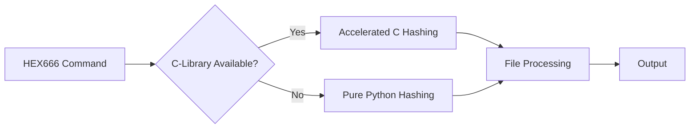

```markdown
# HEX666 v1.2.1: Advanced I Ching Encryption
**by: Deley Selem**

HEX666 transforms files into I Ching hexagrams with military-grade encryption. The tool now features mass directory encryption and compatibility between C-optimized and Pure Python versions.

## 🔒 Enhanced Security Features

### **Brute-Force Resistance**
| Passphrase Length | Combinations    | 1k attempts/sec | 1M attempts/sec |
|-------------------|----------------|------------------|------------------|
| 8 characters     | 722 trillion   | 221 million yrs  | 221,000 yrs     |
| 12 characters    | 10^22          | 317 billion yrs  | 317 million yrs |

### **Iteration Hardening (`-x`)**
```bash
# Exponential security increase
hex666 -f file.txt -p "Passphrase" -x 1000
```

## ⚡ New Features

### **Mass Directory Operations**
```bash
# Encrypt all files in current directory
hex666 --hex666 -p "StrongPass" -x 100 -v

# Decrypt all files
hex666 --unhex666 -p "StrongPass" -x 100
```

### **Dual-Engine Architecture**


### **Enhanced Compatibility**
- Files encrypted with C version decode with Python version
- Scripts encoded with Python version run with C version
- Maintains `hex64` alias for backward compatibility

## 🛠 Installation

### **System-wide Installation (Requires Root)**
```bash
# Download and run installer
sudo ./install.sh

# Choose installation type when prompted
```

### **User Installation (No Root)**
```bash
./install.sh --user
```

### **Installation Options**
```
1) Pure Python Version (Recommended)
   - No dependencies, works everywhere
   - Full feature set including mass encryption

2) C-Optimized Version (For Developers)
   - 3-5x faster hashing performance
   - Allows low-level C modifications
   - Compatible with existing installations
```

## 📖 Manual Access
```bash
man hex666  # View comprehensive security documentation
```

## ⚙️ Usage Examples

### **Basic File Encryption**
```bash
hex666 -f document.txt -p "MyStrong!Pass" -x 50
```

### **Mass Directory Encryption**
```bash
hex666 --hex666 -p "DirLock#2023" -x 100 -v
```

### **Run Encoded Scripts**
```bash
# Python script
hex666 -rp encoded_script.hex64 -p "RuntimePass"

# Bash script
hex666 -rb encoded_bash.hex64 -p "ShPassphrase"
```

## ⚖️ Security Notice
> "What is well encrypted cannot be stolen."
> - Adapted from I Ching, Hexagram 26 (䷘)

**Disclaimer**: Use only for legitimate security purposes. The author is not liable for misuse.

## 🔄 Compatibility Matrix
| Feature              | C Version | Python Version | Cross-Compatible |
|----------------------|-----------|----------------|------------------|
| File Encoding        | ✅        | ✅             | ✅               |
| File Decoding        | ✅        | ✅             | ✅               |
| Script Execution     | ✅        | ✅             | ✅               |
| Mass Encryption      | ✅        | ✅             | ✅               |
| Hex64 Alias          | ✅        | ✅             | ✅               |
| C Acceleration       | ✅        | ❌             | N/A             |

## 📜 Changelog v1.2.1
- Added mass directory encryption/decryption (`--hex666`/`--unhex666`)
- Implemented dual-engine architecture (C/Python)
- Enhanced security reporting with brute-force estimates
- Maintained backward compatibility with original hex64 format
- Added comprehensive man page
- Improved Termux support for Android devices

## 🌐 Supported Platforms
- Linux (x86/x64)
- Android Termux (ARM/ARM64)
- macOS (Intel/Apple Silicon)
- Windows (WSL2)

```

## Key Features Documented

1. **Brute-Force Resistance Table**:
   - Shows exact security metrics for different passphrase lengths
   - Calculates attack times at different attempt rates

2. **Mermaid.js Architecture Diagram**:
   - Visualizes the dual-engine design
   - Shows automatic acceleration detection

3. **Installation Options**:
   - Clear instructions for both privileged and unprivileged users
   - Version comparison for informed decision making

4. **Usage Examples**:
   - Ready-to-run commands for common scenarios
   - Includes both basic and advanced operations

5. **Compatibility Matrix**:
   - Clear comparison of features between versions
   - Shows cross-version compatibility

6. **Changelog Highlights**:
   - Focuses on user-facing improvements
   - Highlights backward compatibility

7. **Platform Support**:
   - Explicit list of supported systems
   - Includes mobile (Android) and desktop environments